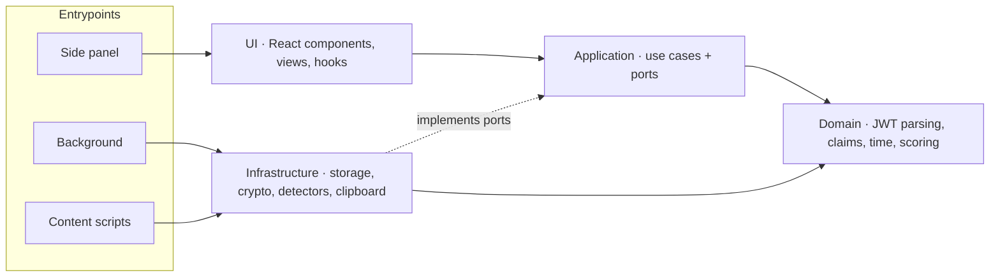

<div align="center">

# JWT Inspector

**Detect, inspect, verify and craft JSON Web Tokens — privately, from your browser's side panel.**

[](https://github.com/lggutierrez0/jwt-inspector/actions/workflows/ci.yml)
[](https://github.com/lggutierrez0/jwt-inspector/actions/workflows/codeql.yml)
[](LICENSE)


[](https://www.conventionalcommits.org)

</div>

---

## Table of contents

- [Why JWT Inspector](#why-jwt-inspector)
- [Project status](#project-status)
- [Features](#features)
- [Privacy and security model](#privacy-and-security-model)
- [Permissions](#permissions)
- [Browser support](#browser-support)
- [Installation](#installation)
- [Usage](#usage)
- [Tech stack](#tech-stack)
- [Architecture](#architecture)
- [Development](#development)
- [Testing](#testing)
- [How we build: SDD + TDD](#how-we-build-sdd--tdd)
- [Quality gates and supply chain](#quality-gates-and-supply-chain)
- [Releases](#releases)
- [Contributing](#contributing)
- [Reporting a vulnerability](#reporting-a-vulnerability)
- [FAQ](#faq)
- [Acknowledgments](#acknowledgments)
- [License](#license)

## Why JWT Inspector

Developers handle JWTs all day: access tokens in `Authorization` headers, session tokens in
cookies, ID tokens in local storage. Understanding one usually means copying a live credential
into a website. JWT Inspector keeps that work inside your browser:

- **Finds tokens for you** in the page you are debugging — requests, cookies, storage — only while
  the panel is open and only on sites you allow.
- **Explains what it finds**: validity, time left, every claim in plain language, and a security
  score grounded in RFC 8725 and OWASP guidance.
- **Lets you build tokens** with every JWS algorithm, a JSON editor and key generation, for tests
  and local development.
- **Never sends anything anywhere.** No servers, no telemetry, no analytics.

## Project status

> [!IMPORTANT]
> **Pre-release, in active development.** The extension is not yet published in the Chrome Web
> Store or Firefox Add-ons. You can build it from source today; features land incrementally
> following the [roadmap](docs/roadmap.md).

| #   | Milestone                                                  | Status     |
| --- | ---------------------------------------------------------- | ---------- |
| 000 | Foundation: tooling, quality gates, side panel shell       | ✅ Done    |
| 001 | Token vault and inspection                                 | 🛠️ Planned |
| 002 | Security score (1–10, cited rules)                         | Planned    |
| 003 | Signature verification (secret, PEM/JWK, JWKS URL)         | Planned    |
| 004 | Token builder (all JWS algorithms, keys, JSON editor)      | Planned    |
| 005 | Automatic detection: cookies, localStorage, sessionStorage | Planned    |
| 006 | Automatic detection: request headers and URL parameters    | Planned    |
| 007 | Opt-in deep capture: bodies and console logs               | Planned    |
| 008 | Vault encryption with passphrase                           | Planned    |
| 009 | Help and about view                                        | Planned    |
| —   | JWE (encrypted tokens)                                     | Deferred   |

Each milestone has its specification under [`specs/`](specs/) once work starts.

## Features

What JWT Inspector does when v1 is complete. Items marked with a milestone number are not yet
implemented.

### Token list — your working set at a glance

- Every detected, saved or created token with a **label**, the **last characters** of the token,
  its **source** (cookie, local storage, session storage, request header, URL parameter, body,
  console log, manual, created), **time left** and **total lifetime**. _(001, sources 005–007)_
- Live countdowns; expired and not-yet-valid tokens are clearly marked. _(001)_
- Delete one token (with undo), clear expired, or clear all. _(001)_

### Detail view — everything public, nothing exposed by accident

- Status first: valid / expired / not yet valid, time left, and a time ruler from issue to expiry,
  with absolute times in your time zone. _(001)_
- Header parameters and claims explained (`iss`, `sub`, `aud`, `exp`, `nbf`, `iat`, `jti`, `alg`,
  `kid`, `jku`, `x5u`, …), raw parts and pretty-printed JSON. _(001)_
- **Sensitive values masked by default** (signature, personal data, secret-looking claims) with a
  per-field reveal toggle; one-click copy for the token and any value. _(001)_
- Rename labels inline. _(001)_
- **Security score from 1 to 10**, each finding explained and linked to its source. _(002)_
- **Signature verification** with a shared secret, a PEM/JWK public key or a JWKS URL. _(003)_

### Token builder

- Every JWS algorithm — HS256/384/512, RS256/384/512, PS256/384/512, ES256/384/512, EdDSA, and
  `none` (with a warning) — chosen from a list, never typed. _(004)_
- Header and payload editor with JSON validation and live preview; expiry helpers
  (`exp`/`nbf`/`iat`). _(004)_
- Enter a secret, or generate / import key pairs (PEM, JWK). _(004)_

### Automatic detection

- Scans the active tab while the panel is open: cookies, local and session storage, request
  headers and URL parameters. _(005, 006)_
- Optional, per-tab deep capture of request/response bodies and console logs. _(007)_

### Everywhere

- English and Spanish, light and dark themes, full keyboard support, WCAG 2.2 AA, usable at 320px.

## Privacy and security model

JWT Inspector handles credentials, so privacy is a design constraint, not a setting. These rules
come from the project [constitution](.specify/memory/constitution.md) and are enforced in review
and CI.

| Guarantee                   | How                                                                                                                           |
| --------------------------- | ----------------------------------------------------------------------------------------------------------------------------- |
| Nothing leaves your browser | No backend, telemetry or analytics. The only request ever made is a JWKS URL you ask to fetch.                                |
| Minimal permissions         | Only `storage` and `activeTab` (plus `sidePanel` on Chromium) at install; site access is requested per site when you need it. |
| Scans only when you look    | Pages are inspected only while the panel is open; deep capture is opt-in per tab.                                             |
| Private storage             | Saved tokens live in extension-only storage — unreadable by web pages or other extensions, never synced.                      |
| Optional encryption         | Passphrase-protected vault with AES-GCM and PBKDF2 (≥ 600,000 iterations) and auto-lock. _(008)_                              |
| Read-only toward pages      | The extension never writes tokens or values into the pages you visit.                                                         |
| Masked by default           | Signatures and sensitive claims stay hidden until you reveal them.                                                            |
| No dynamic code             | No `eval`, no remote code, no HTML injection; strict Content Security Policy.                                                 |

## Permissions

| Permission                                | When                | Why                                                                                 |
| ----------------------------------------- | ------------------- | ----------------------------------------------------------------------------------- |
| `storage`                                 | Install             | Keep your saved tokens and settings in extension-private storage.                   |
| `activeTab`                               | Install             | Read the tab you are looking at when you open the panel.                            |
| `sidePanel` (Chromium only)               | Install             | Show the interface in the browser's side panel. Firefox uses its native sidebar.    |
| Host access (`optional_host_permissions`) | On demand, per site | Scan cookies, storage and requests of a site you choose. You can revoke it anytime. |

## Browser support

| Browser                               | Minimum version | Panel                      |
| ------------------------------------- | --------------- | -------------------------- |
| Chrome, Edge, Brave, Opera (Chromium) | 116             | Side panel                 |
| Firefox                               | 128             | Sidebar (`sidebar_action`) |

## Installation

### From the stores

Not published yet — see [Project status](#project-status). Store links will appear here with the
first release.

### From source

Requirements: [Node.js](https://nodejs.org) 24.19.0 or newer and
[pnpm](https://pnpm.io) 12.6.0 (enable it with `corepack enable`).

```sh
git clone https://github.com/lggutierrez0/jwt-inspector.git
cd jwt-inspector
pnpm install
pnpm build            # Chromium  → .output/chrome-mv3
pnpm build:firefox    # Firefox   → .output/firefox-mv3
```

**Chromium browsers**: open `chrome://extensions`, enable _Developer mode_, choose _Load unpacked_
and select `.output/chrome-mv3`.

**Firefox**: open `about:debugging#/runtime/this-firefox`, choose _Load Temporary Add-on…_ and
select `.output/firefox-mv3/manifest.json`.

## Usage

1. Click the JWT Inspector icon in the toolbar to open the panel.
2. **Add token** and paste a JWT (a leading `Bearer ` is fine) to decode it instantly.
3. Pick any token in the list to open its detail: status and time left first, then claims,
   raw parts and JSON. Reveal masked values only when you need them; copy anything with one click.
4. Once detection ships, grant access to the site you are debugging and its tokens appear in the
   list with their source.

## Tech stack

| Area                | Choice                                                                                                                                                           |
| ------------------- | ---------------------------------------------------------------------------------------------------------------------------------------------------------------- |
| Extension framework | [WXT](https://wxt.dev) — Manifest V3 for Chromium and Firefox from one codebase                                                                                  |
| UI                  | [React 19](https://react.dev), [Tailwind CSS 4](https://tailwindcss.com), [Lucide](https://lucide.dev) icons                                                     |
| Language            | [TypeScript 7](https://www.typescriptlang.org) with the strictest compiler flags                                                                                 |
| Validation          | [Valibot](https://valibot.dev) at storage and messaging boundaries                                                                                               |
| Cryptography        | Web Crypto API (verification and signing from milestones 003–004)                                                                                                |
| Lint / format       | [oxlint](https://oxc.rs) with type-aware rules, oxfmt                                                                                                            |
| Tests               | [Vitest](https://vitest.dev), [Testing Library](https://testing-library.com), [Playwright](https://playwright.dev), [axe](https://github.com/dequelabs/axe-core) |
| Workflow            | [Spec Kit](https://github.com/github/spec-kit) (spec-driven development)                                                                                         |

## Architecture

Layered, with dependencies pointing inward. The domain is pure TypeScript — no browser APIs, no
React — so the logic that decides what a token _means_ is fully unit-tested in isolation.



```text
src/
├── domain/          # pure logic: jwt, time, claims, vault model
├── application/     # use cases and ports (interfaces)
├── infrastructure/  # browser adapters implementing the ports
├── ui/              # React app, components, views, i18n, clock
├── entrypoints/     # WXT entrypoints (wiring only)
├── assets/styles/   # Tailwind @theme tokens (mirrors DESIGN.md)
└── locales/         # en.yml, es.yml
tests/               # shared test setup, fixtures and test doubles
e2e/                 # Playwright journeys against the built extension
specs/               # one folder per feature: spec, plan, tasks, contracts
docs/                # roadmap
```

Visual decisions (palette, typography, components) are documented in [DESIGN.md](DESIGN.md).

## Development

```sh
pnpm install          # installs dependencies and git hooks
pnpm dev              # Chromium with hot reload
pnpm dev:firefox      # Firefox with hot reload
```

| Script               | What it does                                             |
| -------------------- | -------------------------------------------------------- |
| `pnpm dev`           | Development build with hot reload (Chromium)             |
| `pnpm dev:firefox`   | Development build with hot reload (Firefox)              |
| `pnpm build`         | Production build for Chromium                            |
| `pnpm build:firefox` | Production build for Firefox                             |
| `pnpm zip`           | Store-ready zip for Chromium (`zip:firefox` for Firefox) |
| `pnpm check`         | Format check, type-aware lint, typecheck and unit tests  |
| `pnpm test:watch`    | Unit and component tests in watch mode (the TDD loop)    |
| `pnpm test:coverage` | Tests with coverage thresholds                           |
| `pnpm test:e2e`      | Builds and runs Playwright against the real extension    |
| `pnpm lint:fix`      | Apply safe lint fixes                                    |
| `pnpm format`        | Format the codebase                                      |
| `pnpm audit:ci`      | Fail on any known vulnerability in dependencies          |

For E2E tests, install the browser once with `pnpm exec playwright install chromium`.

## Testing

| Level     | Tool                     | Scope                                                          |
| --------- | ------------------------ | -------------------------------------------------------------- |
| Unit      | Vitest                   | Domain logic: parsing, claims, time, scoring                   |
| Component | Vitest + Testing Library | UI behavior queried by role, label and text                    |
| E2E       | Playwright + axe         | Critical journeys in the built extension, accessibility audits |

Coverage gates: **≥ 90%** for `src/domain`, **≥ 80%** overall — enforced before every push and in CI.

## How we build: SDD + TDD

Every feature follows [Spec-Driven Development](https://github.com/github/spec-kit) and
test-first implementation:

1. **Specify** — what and why, with acceptance scenarios (`specs/NNN-feature/spec.md`).
2. **Clarify** — resolve ambiguities before design.
3. **Plan** — research, data model, contracts, constitution check (`plan.md`).
4. **Tasks** — ordered work where every test task precedes the code it drives (`tasks.md`).
5. **Implement** — Red → Green → Refactor: a failing test first, then the minimum code.

The [constitution](.specify/memory/constitution.md) defines the non-negotiable principles: test
first, spec-driven, security and privacy by design, type safety, simplicity, and accessible
UX. Plans must pass its checks before implementation starts.

## Quality gates and supply chain

| Stage  | Checks                                                                                       |
| ------ | -------------------------------------------------------------------------------------------- |
| Commit | oxfmt + oxlint on staged files, typecheck, unit tests, dependency audit, commit message lint |
| Push   | Tests with coverage thresholds                                                               |
| CI     | All of the above, Chromium and Firefox builds, E2E, CodeQL                                   |

Dependency hygiene, configured in [`pnpm-workspace.yaml`](pnpm-workspace.yaml):

- **Exact versions** for every dependency; pnpm pinned to `12.6.0`.
- **Release cooldown**: versions younger than 24 hours are not installed.
- **Trust policy**: installs fail if a package loses its provenance.
- **No install scripts** unless explicitly reviewed and allowed.
- **Audit gate**: any known vulnerability blocks commits and CI.
- GitHub Actions pinned by commit SHA; Dependabot with a cooldown.

## Releases

Releases are automated with [release-please](https://github.com/googleapis/release-please) from
[Conventional Commits](https://www.conventionalcommits.org): merging the release PR updates
`CHANGELOG.md` (created with the first release), bumps the version (the extension manifest version follows
`package.json`), tags the release and attaches store-ready zips for Chromium and Firefox.

## Contributing

Contributions are welcome. Before opening a pull request:

1. Read the [constitution](.specify/memory/constitution.md) and, for UI work, [DESIGN.md](DESIGN.md).
2. For anything beyond a small fix, open an issue first so the change can get a spec.
3. Work test-first; keep `pnpm check` and `pnpm test:e2e` green.
4. Use [Conventional Commits](https://www.conventionalcommits.org) with a scope from
   [`commitlint.config.ts`](commitlint.config.ts), e.g. `feat(ui): add time ruler`.
5. Add English and Spanish text for any user-facing string.

The git hooks run automatically after `pnpm install`; please do not bypass them.

## Reporting a vulnerability

Please **do not open a public issue** for security problems. Report them privately through
GitHub: **Security → Report a vulnerability** in this repository. You will get an
acknowledgment, and fixes are released as soon as possible with credit if you wish.

## FAQ

**Does it send my tokens anywhere?**
No. There is no server. The only network request the extension can make is fetching a JWKS URL
that you explicitly enter to verify a signature.

**Can websites or other extensions read my saved tokens?**
No. They are stored in extension-private storage, which pages and other extensions cannot access,
and they are never synced between devices.

**Why does it ask for access to a site?**
Automatic detection needs to read that site's cookies, storage or requests. Access is requested
per site, only when you enable detection there, and can be revoked at any time.

**Does it support encrypted tokens (JWE)?**
Not yet. JWE tokens are recognized and labeled; decryption is on the roadmap.

**Can I use it to modify requests or inject tokens into pages?**
No, by design. JWT Inspector is read-only toward the pages you visit.

## Acknowledgments

- [RFC 7519](https://www.rfc-editor.org/rfc/rfc7519) (JWT), [RFC 7515](https://www.rfc-editor.org/rfc/rfc7515) (JWS),
  [RFC 7518](https://www.rfc-editor.org/rfc/rfc7518) (JWA) and [RFC 8725](https://www.rfc-editor.org/rfc/rfc8725) (JWT Best Current Practices).
- [OWASP JSON Web Token Cheat Sheet](https://cheatsheetseries.owasp.org/cheatsheets/JSON_Web_Token_for_Java_Cheat_Sheet.html).
- [WXT](https://wxt.dev) and [GitHub Spec Kit](https://github.com/github/spec-kit).

## License

[MIT](LICENSE) © lggutierrez0
